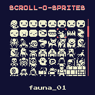

# About this repository

This repository contains sprites from the Scroll-o-sprites already converted to code for consumption in your [WASM-4](https://wasm4.org) games.

The Scroll-o-sprites by Quale contains 250+ sprites licensed under CC-BY-3.0. While the [original site](https://quale-art.blogspot.com) no longer seems available, there is an [imgur album](https://imgur.com/a/uHx4k) containing the sprite sheet and some examples.

This repository also includes a simple sprite viewer allowing to easily identify the sprite you want in the code library.





## Launching the sprite viewer

Run the following

```shell
w4 run viewer/zig-out/lib/cart.wasm
```

Use the arrow on gamepad1 to highlight a sprite, the name of that sprite in the source is displayed at the bottom of the screen.

## Rebuilding

Running make at the top directory will regenerate all source files.
This is generally not needed as the repository already contains sprite definition for many languages.

## Licensing

- The original Scroll-o-sprites content by Quale is licensed under [CC-BY-3.0](https://creativecommons.org/licenses/by/3.0/)
- [STB Image](https://github.com/nothings/stb) is used for extracting sprites from the original PNG file. This is dual licensed under [public domain or MIT](https://github.com/nothings/stb/blob/master/LICENSE).
- The converter/viewer code is licensed under the MIT license as well
